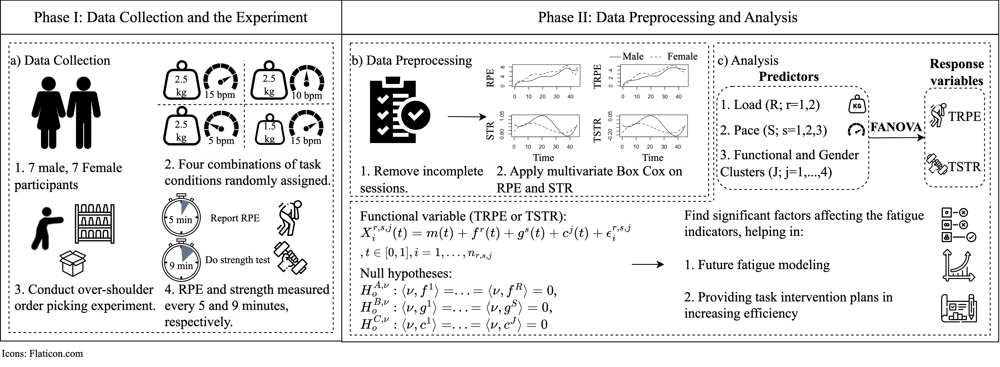
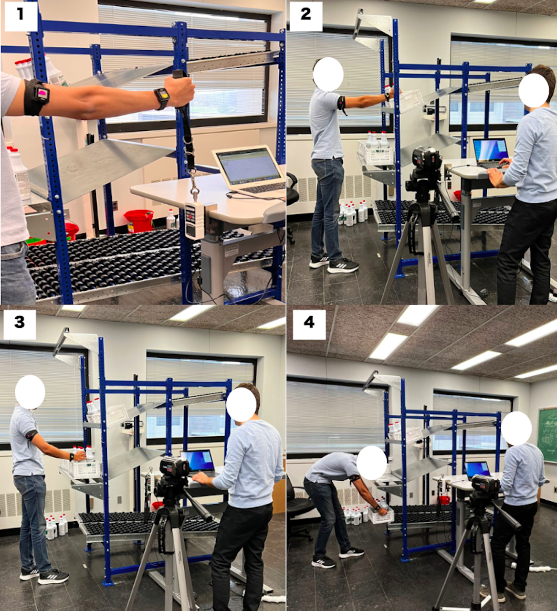

## Project Title

**Functional ANOVA for Upper Extremity Fatigue Analysis during Dynamic Order Picking**

--- 

## Project Members:  
- **Setareh Kazemi Kheiri, Department of Industrial and Systems Engineering, University at Buffalo**, **skazemik@buffalo.edu**
- **Zahra Vahedi, Department of Industrial and Systems Engineering, University at Buffalo**, **zahravah@buffalo.edu**
- **Hongyue Sun, Department of Industrial and Systems Engineering, University at Buffalo**, **hongyues@buffalo.edu**
- **Fadel M. Megahed, Farmer School of Business, Miami University**, **fmegahed@miamioh.edu**
- **Lora A. Cavuoto, Department of Industrial and Systems Engineering, University at Buffalo**, **loracavu@buffalo.edu**

---
## Objective:

This document provides the code, results, and analysis for evaluating the development of fatigue during manual material handling (MMH) operations in a simulated warehousing environment. Our approach is divided into the following main steps: 

1. Data pre-processing;

2. Data transformation;

3. Functional ANOVA on the transformed data;

4. Data clustering; and

5. Functional ANOVA on the clustered transformed data

The below picture shows the framework of this study in more detail.

---
## Introduction of the Experiment and Data:
In this repository you can find the code for the functional ANOVA to find the significant factors impacting the objective and subjective fatigue indicator. Data used in this study is driven from an experiment conducted to assess the fatigue accumulation of **upper limb fatigue** in a repetitive overhead load lifting task. The experiment was conducted with four different conditions, with varying: (a) **task weights:** 1.5 and 2.5 kg, and (b) **task paces:** 5, 10, and 15 bpm. The four conditions are based on the following combinations of pace and weights: 

- 5 bpm -- 2.5 kg,   
- 10 bpm -- 2-5 kg,   
- 15 bpm -- 2.5 kg, and   
- 15 bpm -- 1.5 kg 

A total of 17 people participated in this experiment. Each session of the experiment consisted of three 45-minute periods, with two 15-minute breaks in between the work periods. The [Borg 0-10 Ratings of Perceived Exertion (RPE) Scale](https://my.clevelandclinic.org/health/articles/17450-rated-perceived-exertion-rpe-scale) were captured for each subject every 5 minutes of the experiment. Furthermore, isometric strength tests were taken every 9 minutes. In this analysis, only the data related to the first 45 minutes of experiments were used to assess the impact of task characteristics on the accumulated fatigue, as well as compare the two fatigue indicators (RPE and muscle strength). A demonstration of the different stages of the experiment task is shown in the below figure.

---
## Data Files: 

In the **\data** folder there are three **.xlx** files and 17 folders with names of subjects:
   1. [experimental_design.xlsx](data/experimental_design.xlsx): In the sheet "For analysis" of this file the random order of task conditions (combinations of load and pace) are assigned to different participants. This file is later used in the analysis to understand what task condition was performed in each session of the experiment. 
   2. [experimental_details.xlsx](data/experimental_details.xlsx): In the sheet "For analysis" of this file the time associated with each strength test is identified to be used later in the analysis.
   3. [subject_anthropometrics.xlsx](data/subject_anthropometrics.xlsx): In this file the anthropometrics of participants are saved including their: gender, age, height(cm), weight(kg), waist circumference (cm), hip circumference (cm), and body mass index (BMI).
   4. [Folders "subjx"](data/subj01): In each folder, there are folders named 'session01', 'session02', 'session03', and 'session04'. Some participants who did not complete the experiment and missed one or more sessions might not have all four session folders. In each 'sessionx' folder there are two objects:
      - [RPE.xlsx file](data/subj01/session01/RPE.xlsx): This file contains the reported RPE scores and their associated time, as well as the period of study (work/ break).
      - [strength_data folder](data/subj01/session01/strength_data): Each folder includes three subfolders: '1st_45min', '2nd_45_min', and '3rd_45min' associated with the three 45-minute working periods of the experiment when the strength tests were performed. Each folder includes up to 6 **.xlsx** files that include the isometric strength test results for minutes 0, 9, 18, 27, 36, and 45. In the cases where a participant does not finish the experiment to the end of the 45th minute, the name of the last strength test file (which might not have been captured at an interval of 9 from the one before) is in the form: 'e- x After reporting 10', where x refers to the number of the strength test, and '10' refers to the maximum RPE score.

---
## Codes and Results: 

The codes related to all analyses represented in this study can be found in the ['functional_anova_fatigue.qmd'](functional_anova_fatigue.qmd) file which can be opened and rendered in R Studio after the data files are stored in a local directory same as this file. Some of the custom functions that are used in the QMD file are provided in the ['custom_functions_fanova_fatigue_SK.R'](custom_functions_fanova_fatigue_SK.R) file which will be sourced into the code in the QMD. The rendered 'HTML' file can also be found in this repository entitled ['functional_anova_fatigue_SK.html'](functional_anova_fatigue_SK.html). The plots and figures related to different parts of this analysis can be found in the [**\figs**](figs) folder.
